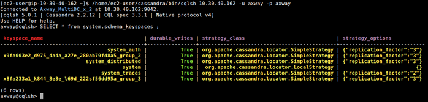
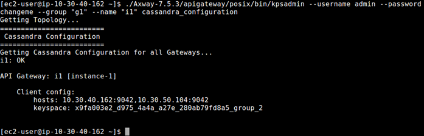
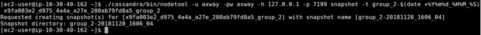

# Apache Cassandra backup and restore

In an Apache
Cassandra database cluster, data is replicated between multiple
nodes and potentially between multiple datacenters. Cassandra is highly
fault-tolerant, and depending on the size of the cluster, it can survive
the failure of one or more nodes without any interruption in service.
However, backups are still needed to recover from the following
scenarios:

  - Any errors made in data by client applications
  - Accidental deletions
  - Catastrophic failure that requires a rebuild of the entire cluster
  - Rollback of the cluster to a known good state in the event of data
    corruption

This topic describes which
Apache Cassandra
data keyspaces to back up, and explains how to use scripts to create and
restore the data in those keyspaces. It also describes which
Apache Cassandra
configuration and API
Gateway configuration to back up.

## Before you begin

| **Caution  ** | You must read all of the following before you perform any of the instructions in this topic: |

  - These instructions apply only to an
    Apache Cassandra
    cluster where the replication factor is the same as the cluster
    size, which means that each node contains 100% of the data. This is
    the standard configuration for
    Axway
    API
    Management processes, and these instructions are intended to
    back up API
    Management keyspaces only.
  - Because 100% of the data is stored on each node, you will run the
    backup procedure on a single node only, preferably on the seed node.
  - The following instructions and scripts are intended as a starting
    point and must be customized and automated as needed to match your
    backup polices and environment.
  - These instructions use the Cassandra snapshot functionality. A
    *snapshot* is a set of hard links for the current data files in a
    keyspace.  

<table>
<tbody>
<tr class="odd">
<td></td>
<td><strong>Note  </strong></td>
<td>While the snapshot does not take up noticeable diskspace, it will cause stale data files not to be cleaned up. This is because a snapshot directory is created under each table directory and will contain hard links to all table data files. 
When Cassandra cleans up the stale table data files, the snapshot files will remain. Therefore, it is critical to remove them promptly. The example backup script takes care of this by deleting the snapshot files at the end of the backup.</td>
</tr>
</tbody>
</table>

  - For safety reasons, the backup location should *not* be on the same
    disk as the Cassandra data directory, and it also must have enough
    free space to contain the keyspace.

## Which data keyspaces to back up?

These procedures apply to data in
API
Management and KPS keyspaces only. You must first obtain a list
of the keyspace names to back up.
API
Management keyspaces may have a custom name defined, but are
named in the format of `<UUID>_group_[n]` by default. For example:

<table>
<tbody>
<tr class="odd">
<td>
`x9fa003e2_d975_4a4a_a27e_280ab7fd8a5_group_2p_2`
</td>
</tr>
</tbody>
</table>

|  | **Note  ** | All Cassandra internal keyspaces begin with `system`, and should not be backed up using this process. |

You can do this using `cqlsh` or `kpsadmin` commands:

### Find keyspaces using cqlsh

Using `cqlsh`, execute the following command:

<table>
<tbody>
<tr class="odd">
<td>`SELECT * from system.schema_keyspaces;`</td>
</tr>
</tbody>
</table>

In the following example, `xxx_group_2` and `xxx_group_3` are
API
Management keyspaces:

### Find keyspaces using kpsadmin

Using `kpsadmin`, choose: `option 30) Show Configuration`, and enter the
API Gateway group and
any instance to back up, or use the command line, as shown in the
following example:

## Back up a keyspace

To back up a keyspace, you will use the `nodetool snapshot` command to
create hard links, run a custom script to back up these links, and then
archive that backup.

|  | **Note  ** | You must repeat these steps for each keyspace to back up. |

1.  Create a snapshot by running the following command on the seed node:

<table>
<tbody>
<tr class="odd">
<td>
`nodetool CONNECTION_PARMS snapshot -t SNAPSHOT_NAME-TIMESTAMP API_GW_KEYSPACE_NAME`
</td>
</tr>
</tbody>
</table>

1.  For example: 

2.  Run the following script to copy the snapshot files to another
    location: 

|  | **Note  ** | This script also clears the snapshot files from the Cassandra `data` directory. |

<table>
<tbody>
<tr class="odd">
<td><code>#!/bin/bash
################################################################################
# Sample Cassandra snapshot backup script                                      #
# NOTE: This MUST be adapted for and validated in your environment before use! #
################################################################################</code></pre>
<pre data-space="preserve"><code>set -e
trap &#39;[ &quot;$?&quot; -eq 0 ] || echo \*\*\* FATAL ERROR \*\*\*&#39; EXIT $?</code></pre>
<pre data-space="preserve"><code># Replace the xxx values below to match your environment
CASSANDRA_DATA_DIR=&quot;xxx&quot;
KEYSPACE_NAME=&quot;xxx&quot;
SNAPSHOT_NAME=&quot;xxx&quot;
BACKUP_ROOT_DIR=&quot;xxx&quot;</code></pre>
<pre data-space="preserve"><code># Example:
#  CASSANDRA_DATA_DIR=&quot;/opt/cassandra/data/data&quot;
#  KEYSPACE_NAME=&quot;x9fa003e2_d975_4a4a_a27e_280ab7fd8a5_group_2&quot;
#  SNAPSHOT_NAME=&quot;Group2-20181127_2144_28&quot;
#  BACKUP_ROOT_DIR=&quot;/backup/cassandra-snapshots&quot;</code></pre>
<pre data-space="preserve"><code>##### Do NOT change anything below this line #####
backupdir=&quot;${BACKUP_ROOT_DIR}/${SNAPSHOT_NAME}&quot;
if [ -d &quot;${backupdir}&quot; ]; then echo -e &quot;\nERROR: Snapshot &#39;${SNAPSHOT_NAME}&#39; already exists in the backup dir&quot;;exit 1; fi
mkdir -p ${backupdir}
keyspace_path=&quot;${CASSANDRA_DATA_DIR}/${KEYSPACE_NAME}&quot;
if ! [ -d &quot;${keyspace_path}&quot; ]; then echo -e &quot;\nERROR: Keyspace path &#39;${keyspace_path}&#39; is not valid&quot;;exit 1; fi</code></pre>
<pre><code>snapshot_dirs=()</code></pre>
<pre data-space="preserve"><code>find &quot;${keyspace_path}/&quot; -maxdepth 1 -mindepth 1 -type d ! -name &quot;$(printf &quot;*\n*&quot;)&quot; &gt; backup.tmp
while IFS= read -r table_dir
do
  str=${table_dir##*/}
  table_uuid=${str##*-}
  len=$((${#str} - ${#table_uuid} - 1))
  table_name=${str:0:${len}}
  echo &quot;Copy table, $table_name&quot;
  current_backup_dir=&quot;${backupdir}/${table_name}&quot;
  mkdir -p &quot;${current_backup_dir}&quot;
  current_snapshot=&quot;${table_dir}/snapshots/${SNAPSHOT_NAME}&quot;
  snapshot_dirs+=(&quot;${current_snapshot}&quot;)
  cp -r -a &quot;${current_snapshot}&quot;/* &quot;${current_backup_dir}/&quot;
done &lt; backup.tmp
rm backup.tmp</code></pre>
<pre data-space="preserve"><code>echo -e &quot;\nRemoving snapshot files from Cassandra data directory&quot;
for dir in &quot;${snapshot_dirs[@]}&quot;
do
  rm -rf &quot;${dir}&quot;
done
</code></td>
</tr>
</tbody>
</table>

When this script finishes, it creates the following backup directory
structure:

<table>
<tbody>
<tr class="odd">
<td>
<code>&lt;BACKUP_ROOT_DIR&gt;
├── &lt;SNAPSHOT_NAME&gt;
│ ├── &lt;TABLE_NAME&gt;
│ │  ├── &lt;SNAPSHOT_FILES&gt;
│ ├── &lt;TABLE_NAME&gt;
│ │  ├── &lt;SNAPSHOT FILES&gt;
│ │...</code></td>
</tr>
</tbody>
</table>

1.  Archive the `SNAPSHOT_NAME` directory using your company's archive
    method so you can restore it later if needed.

|  | **Note  ** | It is best to take a snapshot backup on a daily basis. |

## Restore a keyspace

This section explains how to restore
API
Management and KPS keyspaces and provides an example script to
restore the files.

### Before you begin

|  | **Note  ** | If you are restoring a keyspace to the same cluster that the backup was taken from, skip to [Steps to restore a keyspace](#Restore). |

Before you restore a keyspace in a new Cassandra cluster, you must
ensure the following:

  - The Cassandra cluster must be created to the
    API Gateway HA
    specifications. For more details, see [Configure a highly available
    Cassandra cluster](cassandra_config.htm).
  - All API Gateway
    groups must have their schema created in the new cluster, and the
    replication factor must be the same as the cluster size (normally
    3).
  - If the keyspace name has changed in the new cluster, use the new
    name in the `KEYSPACE_NAME` variable in the restore script.

### Steps to restore a keyspace

1.  Shut down all API
    Gateway instances and any other clients in the Cassandra
    cluster.
2.  Drain and shut down each Cassandra node in the cluster, one node at
    a time.

|  | **Note  ** | You must execute the following (and wait for it to complete) on each Cassandra node before shutting it down, otherwise data loss may occur: |

<table>
<tbody>
<tr class="odd">
<td>`nodetool CONNECTION_PARMS drain`</td>
</tr>
</tbody>
</table>

1.  On the Cassandra seed node, delete all files in the `commitlog` and
    `saved_caches` directory. For example:

<table>
<tbody>
<tr class="odd">
<td>`rm -r /opt/cassandra/data/commitlog/* /opt/cassandra/data/saved_caches/*`</td>
</tr>
</tbody>
</table>

|  | **Note  ** | Do not delete any folders in the keyspace folder on the node being restored. The restore script requires the table directories to be present in order to function correctly. |

1.  On the Cassandra seed node, run the following script to restore the
    snapshot files taken by the backup process and script (described in
    [Back up a keyspace](#Back)):

<table>
<tbody>
<tr class="odd">
<td>
<code>#!/bin/bash
################################################################################
# Sample Cassandra restore snapshot script                                     #
# NOTE: This MUST be adapted for and validated in your environment before use! #
################################################################################</code></pre>
<pre data-space="preserve"><code># Replace the xxx values below to match your environment
CASSANDRA_DATA_DIR=&quot;xxx&quot;
KEYSPACE_NAME=&quot;xxx&quot;
SNAPSHOT_NAME=&quot;xxx&quot;
BACKUP_ROOT_DIR=&quot;xxx&quot;</code></pre>
<pre data-space="preserve"><code># Example:
#  CASSANDRA_DATA_DIR=&quot;/opt/cassandra/data/data&quot;
#  KEYSPACE_NAME=&quot;x9fa003e2_d975_4a4a_a27e_280ab7fd8a5_group_2&quot;
#  SNAPSHOT_NAME=&quot;Group2-20181127_2144_28&quot;
#  BACKUP_ROOT_DIR=&quot;/backup/cassandra-snapshots&quot;</code></pre>
<pre data-space="preserve"><code>##### Do NOT change anything below this line #####
backupdir=&quot;${BACKUP_ROOT_DIR}/${SNAPSHOT_NAME}&quot;
keyspace_path=&quot;${CASSANDRA_DATA_DIR}/${KEYSPACE_NAME}&quot;
echo -e &quot;\n\tRestoring tables from directory, &#39;${backupdir}&#39;, to directory, &#39;${keyspace_path}&#39;&quot;
echo -e &quot;\tRestore snapshot, &#39;${SNAPSHOT_NAME}&#39;, to keyspace, &#39;${KEYSPACE_NAME}&#39;&quot;
read -n 1 -p &quot;Continue (y/n)?&quot; answer
echo -e &quot;\n&quot;
if [ &quot;$answer&quot; != &quot;y&quot; ] &amp;&amp; [ &quot;$answer&quot; != &quot;Y&quot; ]; then
  exit 1
fi</code></pre>
<pre data-space="preserve"><code>set -e
trap &#39;[ &quot;$?&quot; -eq 0 ] || echo \*\*\* FATAL ERROR \*\*\*&#39; EXIT $?</code></pre>
<pre data-space="preserve"><code>if ! [ -d &quot;${backupdir}&quot; ]; then echo -e &quot;\nERROR: Backup not found at &#39;${backupdir}&#39;&quot;;exit 1; fi
if ! [ -d &quot;${keyspace_path}&quot; ]; then echo -e &quot;\nERROR: Keyspace path &#39;${keyspace_path}&#39; is not valid&quot;;exit 1; fi</code></pre>
<pre data-space="preserve"><code>keyspace_tables=$(mktemp)
find &quot;${keyspace_path}/&quot; -maxdepth 1 -mindepth 1 -type d -fprintf ${keyspace_tables} &quot;%f\n&quot;
sort -o ${keyspace_tables} ${keyspace_tables}</code></pre>
<pre data-space="preserve"><code>backup_tablenames=$(mktemp)
find &quot;${backupdir}/&quot; -maxdepth 1 -mindepth 1 -type d -fprintf ${backup_tablenames} &quot;%f\n&quot;
sort -o ${backup_tablenames} ${backup_tablenames}</code></pre>
<pre data-space="preserve"><code>keyspace_tablenames=$(mktemp)
table_names=()
table_uuids=()
while IFS= read -r table
do
  str=${table##*/}
  uuid=${str##*-}
  len=$((${#str} - ${#uuid} - 1))
  name=${str:0:${len}}
  echo &quot;${name}&quot; &gt;&gt; ${keyspace_tablenames}
  table_names+=(${name})
  table_uuids+=(${uuid})
done &lt; ${keyspace_tables}</code></pre>
<pre data-space="preserve"><code>set +e
diff -a -q ${keyspace_tablenames} ${backup_tablenames}
if [ $? -ne 0 ]; then
  echo -e &quot;\nERROR: The tables on the keyspace at, &#39;${keyspace_path}&#39;, are not the same as the ones from the backup at,
&#39;${backupdir}&#39;&quot;
  exit 1
fi</code></pre>
<pre data-space="preserve"><code>for ((i=0; i&lt;${#table_names[*]}; i++));
do
  echo &quot;Restoring table, &#39;${table_names[i]}&#39;&quot;
  table_dir=&quot;${keyspace_path}/${table_names[i]}-${table_uuids[i]}&quot;
  rm -r &quot;${table_dir}&quot;
  mkdir &quot;${table_dir}&quot;
  src=&quot;${backupdir}/${table_names[i]}&quot;
  cp -r -a &quot;${src}&quot;/* &quot;${table_dir}/&quot;
done</code>
</td>
</tr>
</tbody>
</table>

1.  On the other nodes in the cluster, perform the following:

2.    - Delete all files in the `commitlog` and `saved_caches`
        directory.
      - Delete all files in the `KEYSPACE` being restored under the
        `CASSANDRA_DATA_DIRECTORY`. For example:

<table>
<tbody>
<tr class="odd">
<td><code>rm -rf /opt/cassandra/data/data/x9fa003e2_d975_4a4a_a27e_280ab7fd8a5_group_2/*
</code></td>
</tr>
</tbody>
</table>

6.  If you have other keyspaces to restore, return to step 4 and repeat.
    Otherwise, continue to the next steps.
7.  One at a time, start the Cassandra seed node, and then the other
    nodes, and wait for each to be in Up/Normal (`UN`) state in
    `nodetool status` before you proceed to the next node.
8.  Perform a full repair of the cluster as follows on each node one at
    a time:  

<table>
<tbody>
<tr class="odd">
<td><code>nodetool repair -pr --full</code></td>
</tr>
</tbody>
</table>

6.  Start the API
    Gateway instances.

## Which configuration to back up?

In addition to backing up your data in
Apache Cassandra
keyspaces, you must also back up your
Apache Cassandra
configuration and API
Gateway configuration.

### Apache Cassandra configuration

You must back up the `CASSANDRA_HOME/conf` directory on all nodes.

### API Gateway group configuration

You must back up the API
Gateway group configuration in the following directory:

<table>
<tbody>
<tr class="odd">
<td><code>API_GW_INSTALL_DIR/apigateway/groups/&lt;group-name&gt;/conf</code></td>
</tr>
</tbody>
</table>

This directory contains
the API
Gateway, API
Manager, and KPS configuration data.
